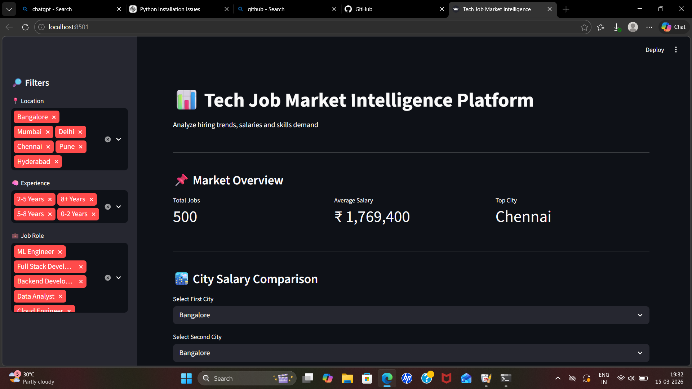
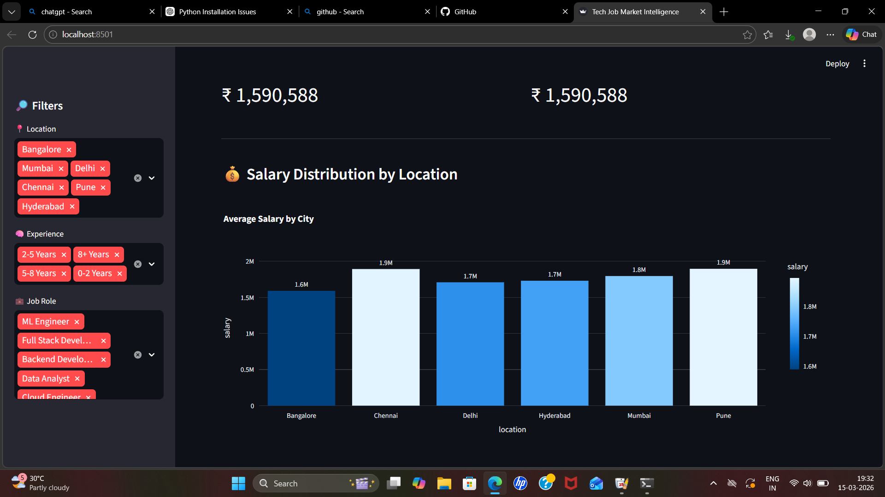
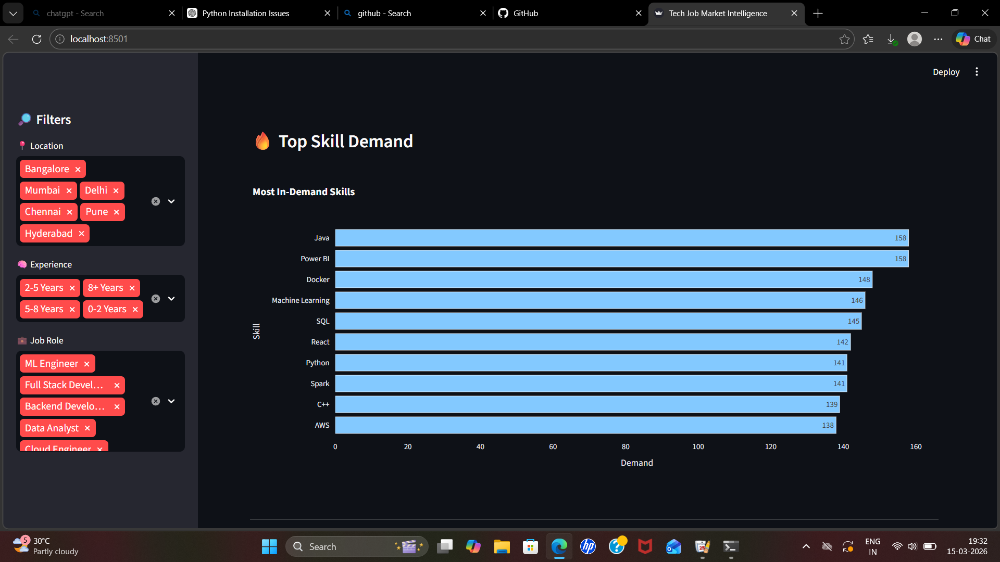
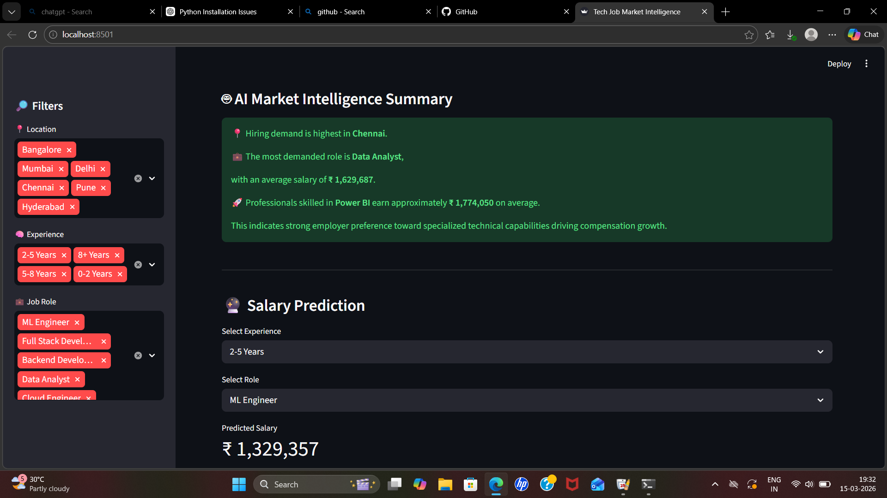

# Tech Job Market Intelligence Dashboard

## Overview

The **Tech Job Market Intelligence Dashboard** is a data analysis project that explores trends in the technology job market.

The application analyzes job market data to identify in-demand skills, popular job roles, and salary trends. The insights are presented through an interactive dashboard built using Streamlit.

This project helps students, job seekers, and professionals understand the current demand for different technologies in the job market.

---

## Features

* Interactive dashboard built with Streamlit
* Visualization of in-demand technical skills
* Analysis of job role demand
* Salary trend insights
* Simple and user-friendly interface

---

## Tech Stack

Python
Pandas
Streamlit
Matplotlib / Plotly
Git & GitHub

---

## Live Demo
try the application here:
https://tech-job-intelligence-faeozcmeegq6857armxauz.streamlit.app/

---

## Screenshots

---

## Installation

Clone the repository

git clone https://github.com/likhitha4631-sudo/tech-job-intelligence.git

Navigate to the project folder

cd tech-job-intelligence

Install required libraries

pip install -r requirements.txt

Run the Streamlit application

streamlit run app.py

---

## Future Improvements

* Integrate real-time job data from APIs
* Improve data visualizations
* Add filtering by location and experience level
* Add AI-based skill recommendations

---

## Author

Likhitha S
BCA Student | Aspiring Data Analyst
